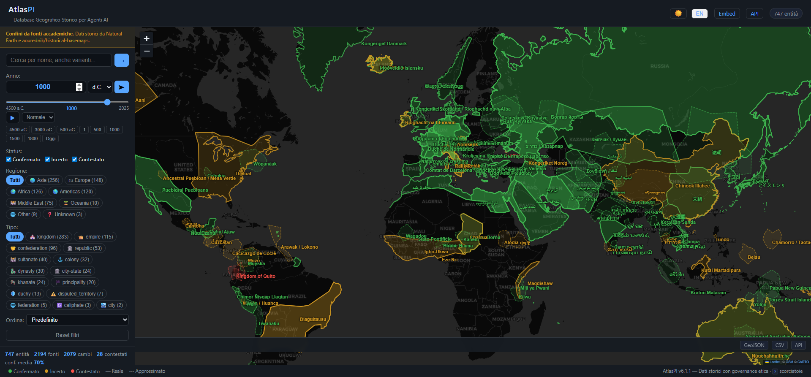

<p align="center">
  <h1 align="center">🌍 AtlasPI</h1>
  <p align="center">
    <strong>The structured historical geographic database built for AI agents.</strong>
  </p>
  <p align="center">
    Query any empire, kingdom, or territory from 4500 BCE to 2024 &mdash; with coordinates,<br>
    boundaries, confidence scores, and 2,000+ academic sources.
  </p>
</p>

<p align="center">
  <a href="https://atlaspi.cra-srl.com"></a>
  <a href="#-quick-start"></a>
  <a href="#-dataset-overview"></a>
  <a href="#-dataset-overview"></a>
  <a href="#-dataset-overview"></a>
  <a href="#-dataset-overview"></a>
  <a href="#-dataset-overview"></a>
  <a href="#-architecture"></a>
  <a href="#-license"></a>
  <a href="#-api-documentation"></a>
  <a href="mcp-server/README.md"></a>
  <a href="https://doi.org/10.5281/zenodo.19581784"></a>
</p>

<p align="center">
  <strong>Live: <a href="https://atlaspi.cra-srl.com">atlaspi.cra-srl.com</a></strong> &middot;
  <a href="https://atlaspi.cra-srl.com/docs">API Docs</a> &middot;
  <a href="https://atlaspi.cra-srl.com/app">Map App</a> &middot;
  <a href="mcp-server/README.md">MCP Server</a>
</p>

---

## Why AtlasPI exists

AI agents working with historical geography today face a fragmented landscape: raw shapefiles in Natural Earth, unstructured text in Wikipedia, scattered coordinates in Wikidata, and academic datasets locked behind incompatible formats. None of these were designed for machine consumption.

AtlasPI bridges this gap. It provides a single, structured REST API where an AI agent can ask *"What territories existed in the Balkans in 1400?"* or *"Show me the boundary changes of the Ottoman Empire"* and get back clean JSON with GeoJSON boundaries, confidence scores, academic citations, and honest metadata about what is certain and what is disputed.

Historical data is never neutral. Borders were drawn through conquest, names were imposed through colonization, populations were erased through genocide. AtlasPI does not sanitize this complexity -- it structures it, documents it, and makes it queryable.

---

## Screenshot



The web UI supports keyboard shortcuts, deep linking (`/app?year=1000`), continent filtering, time playback animation, dark/light mode, and full i18n (English/Italian). Try it live at **[atlaspi.cra-srl.com](https://atlaspi.cra-srl.com/app)**.

---

## Quick Start

```bash
# Clone the repository
git clone https://github.com/Soil911/AtlasPI.git
cd AtlasPI

# Install dependencies
pip install -r requirements.txt

# Run the server (auto-seeds the database on first launch)
python run.py
```

The API is now live at **http://localhost:10100** and the interactive docs at **http://localhost:10100/docs**.

### Docker

```bash
docker compose up --build
```

---

## API Documentation

AtlasPI exposes 23 REST endpoints under `/v1/`. Full interactive documentation is available at `/docs` (Swagger UI) and `/redoc` when the server is running.

### Core Endpoints

| Method | Endpoint | Description |
|--------|----------|-------------|
| `GET` | `/v1/entity` | Query entities with filters (name, year, status, type) |
| `GET` | `/v1/entities` | Paginated list of all entities |
| `GET` | `/v1/entities/{id}` | Full detail for a single entity |
| `GET` | `/v1/search?q=` | Autocomplete search |
| `GET` | `/v1/types` | List available entity types |
| `GET` | `/v1/stats` | Dataset statistics |
| `GET` | `/v1/continents` | Available continent/region filters |
| `GET` | `/v1/random` | Random entity (with optional type/year/status/continent filters) |
| `GET` | `/v1/aggregation` | Aggregate stats by century, type, continent, status |
| `GET` | `/v1/nearby?lat=&lon=` | Find entities near coordinates (with distance) |
| `GET` | `/v1/snapshot/{year}` | World state at a given year (summary + entities) |
| `GET` | `/v1/compare/{id1}/{id2}` | Structured comparison of two entities |
| `GET` | `/v1/entities/{id}/contemporaries` | Entities with overlapping time periods |
| `GET` | `/v1/entities/{id}/related` | Related entities by type or region |
| `GET` | `/v1/entities/{id}/evolution` | Full chronological evolution of an entity |
| `GET` | `/v1/export/geojson` | Export as GeoJSON FeatureCollection |
| `GET` | `/v1/export/csv` | Export as CSV |
| `GET` | `/v1/export/timeline` | Export timeline data |
| `GET` | `/health` | Service health check |
| `GET` | `/embed` | Embeddable map view for iframes |

### Examples

**Search for empires active in 1500 CE:**
```bash
curl "http://localhost:10100/v1/entity?type=empire&year=1500"
```

**Get full details for entity #12:**
```bash
curl "http://localhost:10100/v1/entities/12"
```

**Find entities contemporary to the Roman Empire:**
```bash
curl "http://localhost:10100/v1/entities/1/contemporaries"
```

**Export all entities as GeoJSON:**
```bash
curl "http://localhost:10100/v1/export/geojson" -o atlas.geojson
```

**Find entities near Rome active in 100 CE:**
```bash
curl "http://localhost:10100/v1/nearby?lat=41.9&lon=12.5&year=100&radius=500"
```

**Snapshot of the world in 1500 CE:**
```bash
curl "http://localhost:10100/v1/snapshot/1500" | jq '.summary'
```

**Compare two entities side by side:**
```bash
curl "http://localhost:10100/v1/compare/1/5"
```

### Response Example

```json
{
  "id": 1,
  "name": "Imperium Romanum",
  "name_variants": [
    {"name": "Roman Empire", "language": "en"},
    {"name": "Imperio Romano", "language": "es"}
  ],
  "entity_type": "empire",
  "year_start": -753,
  "year_end": 476,
  "status": "confirmed",
  "confidence_score": 0.95,
  "capital": {"name": "Roma", "lat": 41.9028, "lon": 12.4964},
  "territory_changes": [...],
  "sources": [
    {"citation": "...", "source_type": "academic"}
  ]
}
```

---

## Dataset Overview

**846 historical entities + 211 historical events** spanning 6,500 years of human civilization, backed by **3,000+ academic sources** and documenting **2,000+ territory changes**. Events include battles, treaties, epidemics, genocides, colonial violence, massacres, deportations and natural disasters — with ETHICS-007 (no euphemisms) and ETHICS-008 (`known_silence` flag for erased/suppressed records).

### Coverage by Region

| Region | Entities | Examples |
|--------|----------|---------|
| Asia | 195 | Mongol Empire, Qin/Han/Tang/Song/Ming, Tokugawa, Mughal, Khmer, Three Kingdoms |
| Europe | 104 | Roman Empire, Byzantine, Kyivan Rus', Hanseatic League, Crusader states, Prussia |
| Americas | 85 | Tawantinsuyu (Inca), Aztec, Maya, Haudenosaunee, Empire of Brazil, Taino |
| Africa | 78 | Mali, Songhai, Kingdom of Kongo, Great Zimbabwe, Aksum, Zulu, Buganda |
| Middle East | 70 | Achaemenid, Ottoman, Abbasid Caliphate, Rashidun, Kingdom of Jerusalem |
| Oceania & Pacific | 8 | Aboriginal nations, Maori iwi, Kingdom of Tonga, Hawaiian Kingdom |

### Entity Types

15 categories: `empire` | `kingdom` | `republic` | `confederation` | `city-state` | `dynasty` | `colony` | `disputed_territory` | `sultanate` | `khanate` | `principality` | `duchy` | `caliphate` | `federation` | `city`

### Time Coverage

- **Earliest entity:** 4500 BCE (ancient Mesopotamian civilizations)
- **Latest entity:** 2024 (modern states and disputed territories)
- Negative years represent BCE dates (e.g., `-753` = 753 BCE)

---

## 📖 Citation

If you use AtlasPI in research, teaching, or derivative datasets, please cite the project using the Zenodo concept DOI below. The concept DOI always resolves to the latest release — individual versions get their own per-release DOIs on top.

### BibTeX

```bibtex
@software{atlaspi_2026,
  author       = {{AtlasPI Project}},
  title        = {AtlasPI: A structured historical geographic database for AI agents},
  version      = {6.10.0},
  year         = {2026},
  doi          = {10.5281/zenodo.19581784},
  url          = {https://doi.org/10.5281/zenodo.19581784}
}
```

### Plain-text citation

AtlasPI Project (2026). *AtlasPI: A structured historical geographic database for AI agents*, version 6.10.0. Zenodo. https://doi.org/10.5281/zenodo.19581784

---

## Ethical Framework

Historical data carries the weight of conquest, displacement, and erasure. AtlasPI is built on four principles that govern every data decision:

### 1. Truth Before Comfort

Historical records include conquest, genocide, forced deportation, and cultural erasure. These facts are represented with precision, never sanitized. If a territory was seized by force, the `acquisition_method` field says so. If a population was decimated, the data shows it with sources. If a geographic name was imposed by erasing the original, both names are present.

### 2. No Single Version of History

Contested borders show all known versions, with dates and sources. Place names include the original local form alongside names in other relevant languages. Academic disputes are made explicit, not resolved by fiat. The database does not arbitrate history -- it documents it.

### 3. Transparency of Uncertainty

Every record carries a `confidence_score` from 0.0 to 1.0. Every data point includes `sources[]` with primary source citations. Records scoring below 0.5 are marked as `status: "disputed"`. An uncertain datum honestly labeled is more valuable than a fabricated certainty.

### 4. No Geographic or Cultural Bias

Place names use the local-language form as the primary name. Sources include non-Western historiography where available. Colonial conquests are documented from the perspective of the colonized, not only the colonizers.

> These principles are enforced through automated ethical tests, documented decisions in `docs/ethics/`, and `# ETHICS:` comments throughout the codebase. See [CLAUDE.md](CLAUDE.md) for the full governance framework.

---

## Architecture

### Tech Stack

| Component | Technology |
|-----------|------------|
| API | FastAPI (Python 3.11+) |
| Database (dev) | SQLite |
| Database (prod) | PostgreSQL + PostGIS |
| Validation | Pydantic v2 |
| Rate Limiting | SlowAPI |
| Frontend | Vanilla JS + Leaflet.js |
| Containerization | Docker (multi-stage build) |
| CI | GitHub Actions (lint + test + build) |

### Project Structure

```
atlaspi/
  src/
    api/            # FastAPI routes, schemas, error handling
    db/             # SQLAlchemy models, database setup, seed data
    ingestion/      # Data import pipelines, boundary extraction
    validation/     # Confidence scoring engine
  static/           # Web UI (HTML, CSS, JS)
  data/
    entities/       # Source entity data (JSON)
    raw/            # Original unmodified source data
    processed/      # Normalized data
  tests/            # 260 tests: technical, ethical, security, performance, data quality
  docs/
    adr/            # Architecture Decision Records
    ethics/         # Documented ethical decisions (ETHICS-001, 002, 003...)
```

### Key Design Decisions

- **Dual database support:** SQLite for zero-config local development, PostgreSQL + PostGIS for production spatial queries.
- **Auto-seeding:** The database populates itself on first launch from JSON entity files -- no manual migration needed.
- **GZip compression**, **CORS**, **rate limiting** (60 req/min), and **security headers** enabled by default.
- **Structured logging:** JSON format in production, human-readable in development.

---

## Testing

The test suite covers five dimensions:

```bash
# Run all tests
pytest

# Run with verbose output
pytest -v
```

| Category | What it verifies |
|----------|-----------------|
| **Technical** | API responses, pagination, input validation, edge cases |
| **Ethical** | ETHICS-001/002/003 compliance, disputed territory handling, confidence thresholds |
| **Security** | CORS, security headers, structured error responses, rate limiting |
| **Performance** | All endpoints respond in < 500ms |
| **Data Quality** | Source completeness, regional diversity, entity type coverage |

---

## Contributing

Contributions are welcome. Before you start:

1. **Read [CLAUDE.md](CLAUDE.md)** -- it contains the project's core values and development conventions.
2. **Check `docs/ethics/`** -- understand the ethical decisions already made.
3. **Check `docs/adr/`** -- understand the architectural decisions already made.

### Guidelines

- Code is written in **English**; documentation in **Italian** (except this README).
- Every function touching sensitive historical data must include an `# ETHICS:` comment explaining the design choice.
- Tests must cover ethical edge cases, not only technical ones.
- New entity data must include `sources[]` with verifiable academic citations.
- Disputed territories must have `confidence_score <= 0.7` and `status: "disputed"`.

### Adding Historical Entities

Entity data lives in `data/entities/` as JSON files. Each entity requires:
- Primary name in the original/local language
- At least one academic source
- A confidence score reflecting source reliability
- Territory changes with dated boundaries where available

### Development Setup

```bash
# Install with dev dependencies
pip install -e ".[dev]"

# Lint
ruff check src/ tests/

# Test
pytest -v
```

---

## Roadmap

See [ROADMAP.md](ROADMAP.md) for the full development plan. Key upcoming milestones:

- PostgreSQL + PostGIS spatial queries in production
- Full GeoJSON boundary coverage for all entities
- Wikidata/OpenStreetMap ingestion pipelines
- Premium API tier with higher rate limits
- Hosted instance with public access

---

## How to Cite

If you use AtlasPI in academic work, teaching, or derivative datasets, please cite it. A machine-readable [`CITATION.cff`](CITATION.cff) is provided in the repository root and is recognized by GitHub, Zenodo, Zotero, and most reference managers.

### Suggested citation (software)

> Ramadani, C. (2026). *AtlasPI: A structured historical geographic database for AI agents* (Version 6.1.2) [Software]. CRA. https://doi.org/10.5281/zenodo.19581784

### BibTeX

```bibtex
@software{ramadani_atlaspi_2026,
  author       = {Ramadani, Clirim},
  title        = {AtlasPI: A structured historical geographic database for AI agents},
  version      = {6.1.2},
  year         = {2026},
  publisher    = {CRA},
  doi          = {10.5281/zenodo.19581784},
  url          = {https://doi.org/10.5281/zenodo.19581784},
  note         = {Live instance: https://atlaspi.cra-srl.com. Concept DOI (all versions): 10.5281/zenodo.19581784. Version v6.1.2 DOI: 10.5281/zenodo.19581785.}
}
```

### Citing the underlying boundary sources

AtlasPI derives its geographic boundaries from two upstream datasets. If your work depends on spatial precision, please also cite them directly:

- **Natural Earth** (public domain) — post-1800 modern administrative boundaries. https://www.naturalearthdata.com/
- **aourednik/historical-basemaps** (CC BY 4.0) — pre-1800 historical world timestamps. Ourednik, A. *historical-basemaps*. https://github.com/aourednik/historical-basemaps

For full methodology on how boundaries are assigned, matched, and confidence-scored, see [docs/METHODOLOGY.md](docs/METHODOLOGY.md).

The dataset has a permanent DOI minted by Zenodo: [10.5281/zenodo.19581784](https://doi.org/10.5281/zenodo.19581784) (concept DOI, always resolves to the latest version). Every tagged release mints a new version DOI; see the [Zenodo record](https://zenodo.org/records/19581785) for v6.1.2 specifically. Deposition metadata is in [`.zenodo.json`](.zenodo.json).

---

## License

AtlasPI follows an **open core** model.

The core project -- API, data models, ethical framework, and documentation -- is released under the **Apache License 2.0**.

Imported datasets retain their original licenses. Every source is tracked and attributed. Premium components (hosted services, curated datasets, enterprise features) are maintained separately from the open source core.

See [LICENSE](LICENSE) for the full Apache License 2.0 text and [NOTICE](NOTICE) for third-party attributions.

---

## Acknowledgments

AtlasPI builds on the work of:

- **[Natural Earth](https://www.naturalearthdata.com/)** -- public domain vector map data for modern boundaries
- **[aourednik/historical-basemaps](https://github.com/aourednik/historical-basemaps)** -- historical world boundary data
- **[OpenStreetMap](https://www.openstreetmap.org/)** -- geographic data under ODbL
- **[Wikidata](https://www.wikidata.org/)** -- structured knowledge base under CC0

And the countless historians, cartographers, and researchers whose work makes structured historical geography possible.

---

<p align="center">
  <sub>Built with the conviction that historical truth, including its uncomfortable parts, should be structured, accessible, and machine-readable.</sub>
</p>
